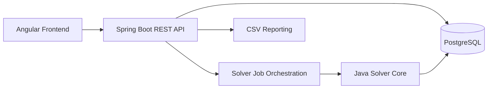
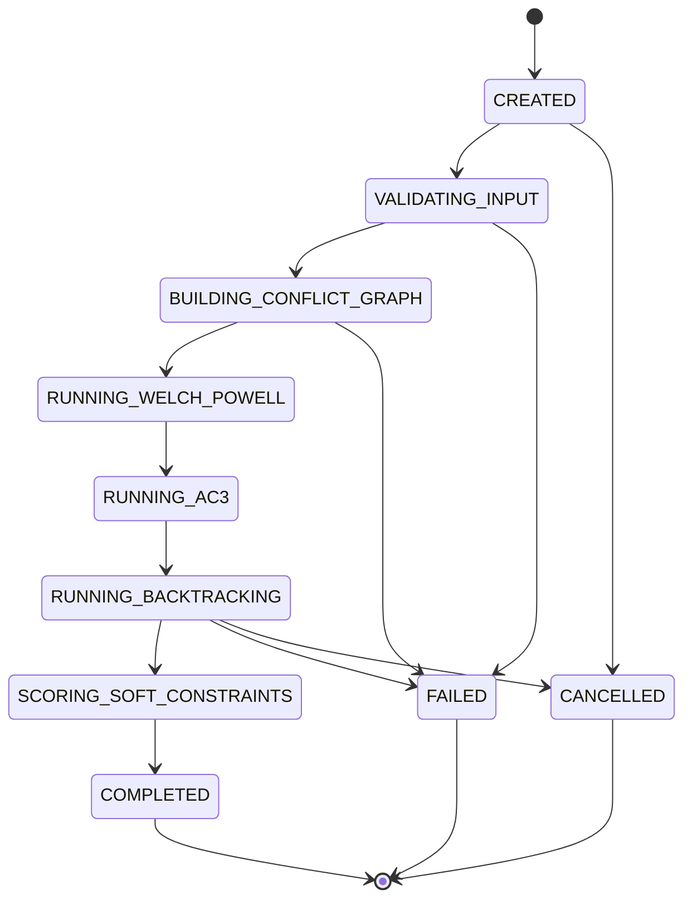
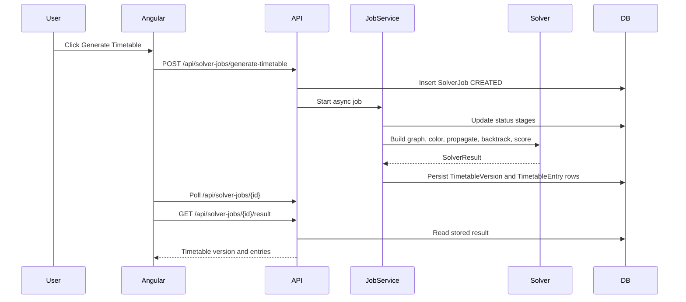
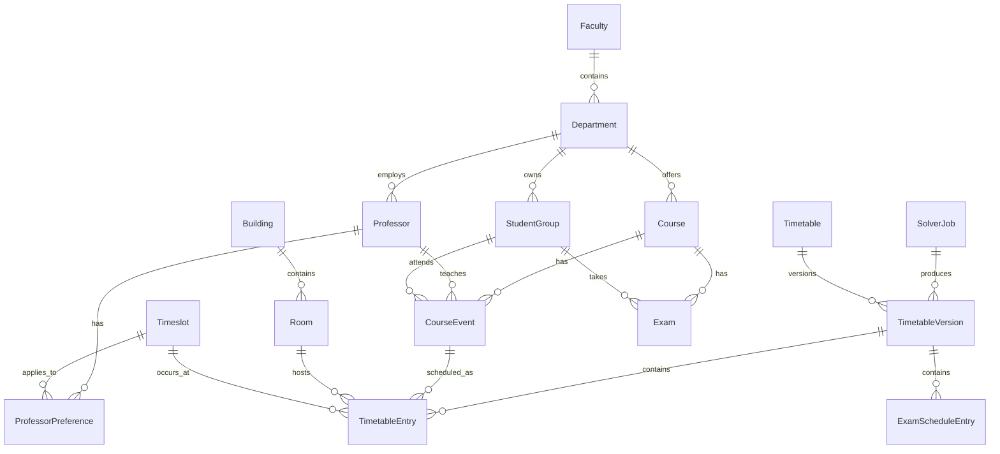
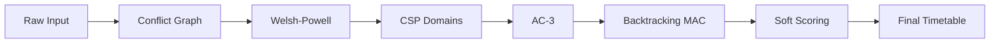

# Architecture

The application is a JHipster modular monolith. It keeps deployment simple for a university demo while separating academic data, solver orchestration, algorithm code, timetable persistence, reports, and UI concerns.

## System Architecture

## Solver Workflow

## Data Flow

## Domain Relationship Overview

## Algorithm Pipeline

## Package Structure

Important packages:

- `com.unischeduler.solver.graph`
- `com.unischeduler.solver.csp`
- `com.unischeduler.solver.ac3`
- `com.unischeduler.solver.backtracking`
- `com.unischeduler.solver.heuristics`
- `com.unischeduler.solver.scoring`
- `com.unischeduler.service`
- `com.unischeduler.web.rest`
